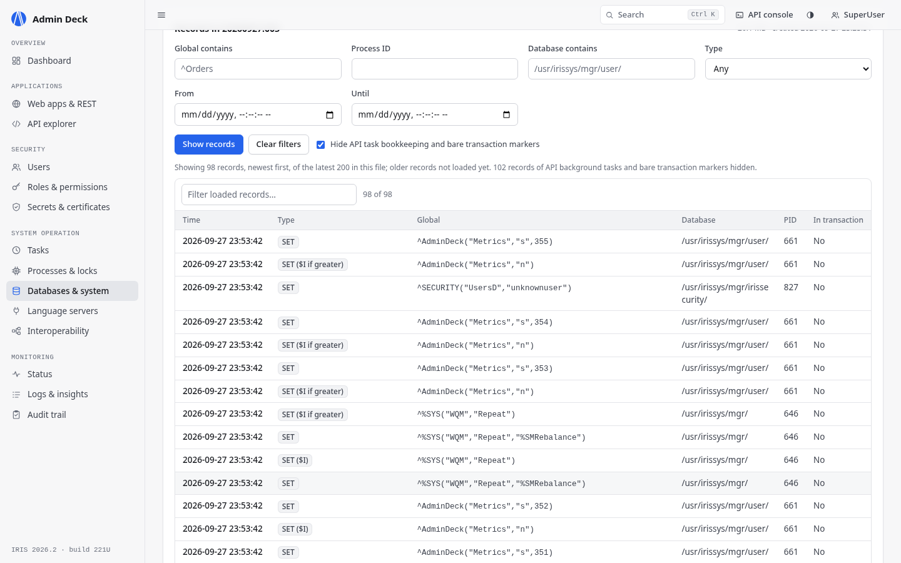
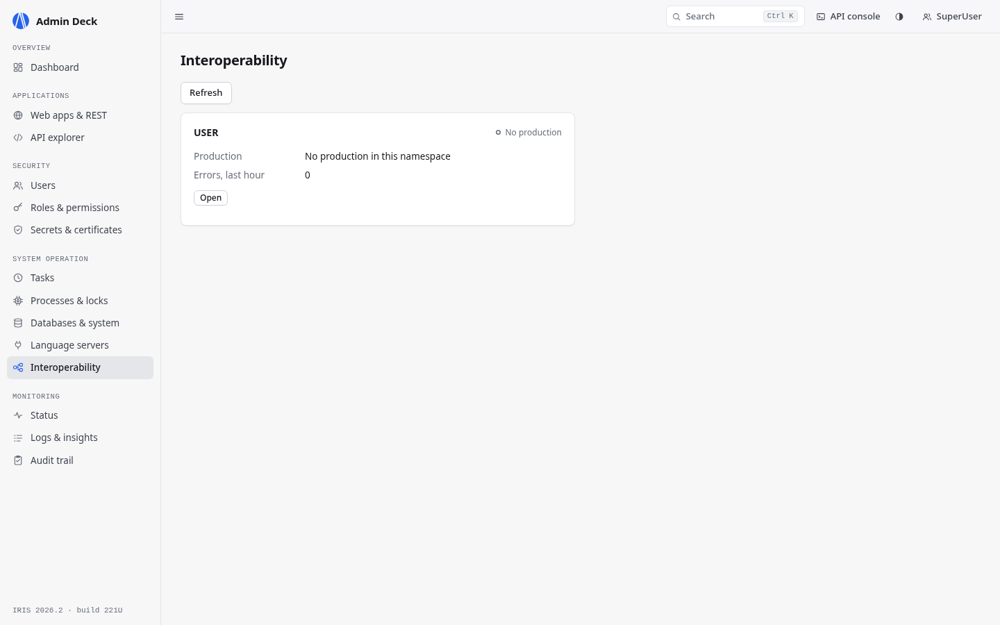
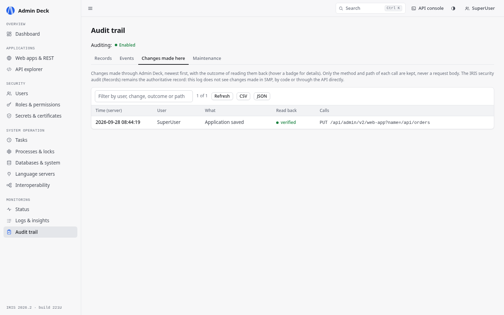
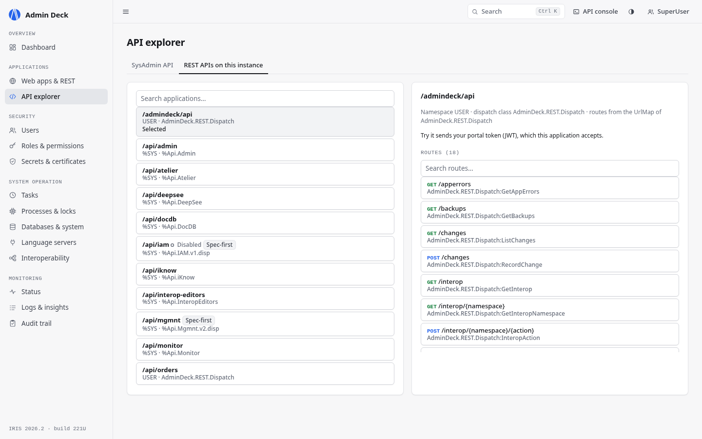

# IRIS Admin Deck

[](https://github.com/DawidKrynski/iris-admin-deck/actions/workflows/ci.yml)

A web UI for administering one InterSystems IRIS 2026.2+ instance through the SysAdmin REST API
(`/api/admin/v2`). It covers web applications, users, roles and resources, wallet and certificates, tasks,
processes, databases, namespaces, journals, backups, language servers and Interoperability productions. On
top of that it adds a log timeline, a viewer for rotated `messages.old_*` files and a similar-incident
search, which the API doesn't have. Every request the page sends is listed in the API console and can be
copied as `curl`.

I wrote it for the person who gets the call when something on an IRIS instance breaks: they need to see
what went wrong, find out whether it happened before, fix it, and be sure the fix actually took.

If you have two minutes:

- Open the online demo, <https://niutics.pl/interSystems>, and sign in as `demo` / `demo`. It is read-only:
  every screen can be browsed, changes are refused.
- Follow [A morning on call](#a-morning-on-call) below: six steps from the dashboard warning to the fix.
- To try the changes too, run it locally with one command, `docker compose up -d --build`
  ([details](#run-it)).


## A morning on call

The demo data contains a small incident, so you can walk through it in the demo or locally:

1. The dashboard's Needs attention list says the REPORTS database is dismounted.
2. Logs & insights, Timeline, filtered by `reports`: the Sales export task, which runs every 5 minutes,
   fails with `<PROTECT>` on `^Daily` in the REPORTS directory. Below it are the dismount in `messages.log`
   and the audit record of who did it.
3. Similar incidents, from the dismount line, lists the log entries that read like it. In the demo there is
   one for every start of the container: the database goes away on each restart, which is the real finding.
4. Mount, offered on the dismount line, shows the exact call first. After the call the page reads the
   database back and reports whether it is mounted now.
5. Run again on the failed task line re-runs the export, which now passes.
6. The API console lists every call you just made; Copy curl turns the mount into a line for a runbook.

On the public demo steps 4 and 5 are refused (it is read-only); locally they work.

## Run it

### Without cloning

```bash
docker run -d -p 127.0.0.1:52785:52773 ghcr.io/dawidkrynski/iris-admin-deck
```

An image is published for each release tag, for amd64 and arm64. The command uses `latest`;
use a release tag instead to keep a specific version, for example `:v1.0.1`.
Open <http://localhost:52785/admindeck/index.html> and sign in with `SuperUser` / `SYS`.
That login is for the local demo only; change the passwords for anything else.

### Docker

Requires Docker with Compose.

```bash
git clone https://github.com/DawidKrynski/iris-admin-deck.git
cd iris-admin-deck
docker compose up -d --build
```

Open <http://localhost:52785/admindeck/index.html> and sign in with `SuperUser` / `SYS`. That login is for the
local demo container only; change the passwords for anything else. If port 52785 is taken, pick another one:
`ADMINDECK_PORT=8080 docker compose up -d --build`.

The first build pulls a 3.6 GB base image and takes a few minutes; the running container uses about 1.2 GB
of RAM. The instance lives inside the container: `docker compose stop` / `start` keep your changes,
`docker compose down` throws them away and the next `up` starts again from the demo state.

The build seeds demo data through the SysAdmin API itself ([scripts/demo_seed.py](scripts/demo_seed.py)):
two X.509 credentials (one expires in 12 days, so the expiry warning has something to show), a wallet
collection with dummy secrets, a rotated `messages.old_*` log and a limited user `demo_operator` / `operator`
(role `%Operator`) to see how the navigation hides screens you have no privilege for.
It also sets up the incident described above: database REPORTS and a Sales export task that reads it.
The container's startup hook dismounts REPORTS after every start, so the export starts failing
within 5 minutes. Build with `--build-arg DEMO=0` to skip the seed.

If the page doesn't open:

```bash
docker compose ps                # the iris service should be "healthy" about a minute after start
docker compose logs --tail 50 iris
curl -sI http://localhost:52785/admindeck/index.html
```

Smoke test against a running instance:

```bash
scripts/smoke.sh http://localhost:52785
```

### IPM (existing IRIS 2026.2+ instance)

From a clone of this repository:

```objectscript
USER> zpm "load /path/to/iris-admin-deck"
```

or, once it is published to the Open Exchange registry:

```objectscript
USER> zpm "install iris-admin-deck"
```

Then open `http://<host>:<port>/admindeck/index.html`. The package creates two web applications:
`/admindeck` (the static UI) and `/admindeck/api` (a small extension REST API, JWT enabled).

### Requirements

- InterSystems IRIS or IRIS for Health Community Edition 2026.2 or newer. The SysAdmin API v2 does not
  exist before 2026.2, and `intersystemsdc/iris-community:latest` is still 2026.1, so the Dockerfile uses
  `intersystemsdc/iris-community:2026.2-zpm`. I tested it on that image and on
  `intersystemsdc/irishealth-community:2026.2-zpm`
  (`docker compose build --build-arg IMAGE=intersystemsdc/irishealth-community:2026.2-zpm`), amd64 only;
  both images are also published for arm64.
- Embedded Python (included in those images). OS metrics read `/proc`, so they work on Linux and in
  containers only.
- A user with the `%Admin_*` resources for the screens they need (e.g. `%All`).
- One instance per browser tab. There is no multi-instance view.
- For a public deployment, `set ^AdminDeck("Settings","HideHostDetails")=1` (in the package namespace)
  hides the kernel version, host name and uptime from the OS metrics.

## What's in it

| Screen | What you can do there |
| --- | --- |
| Dashboard | Health checks, global refs/s and CPU charts, CPU/memory/disk, license use, upcoming tasks, and a "needs attention" list (errors, certificates expiring soon, dismounted databases, recurring log warnings) |
| Status | Checks first: about ten of them (dismounted databases, journaling, size limits, certificates, backups, failed and suspended tasks, license, disk and journal space, the metrics sampler, auditing), failing ones on top, each with the object and number it is based on, one sentence of advice and a fix, or why it was not checked. Then one row per component (instance state, Web Gateway latency, database read latency, SQL runtime, CPU) with a bar per minute for the last hour, plus warnings/errors per hour for the last day |
| Web apps & REST | List, create from a REST or static preset, edit, enable/disable, delete. System applications can't be deleted |
| Users, Roles & permissions | Users, roles, resources, `%Service_*` services, an access matrix (which role or public permission gives a user each resource), SQL object/column/admin privileges |
| Secrets & certificates | Wallet collections and secrets (write-only values), X.509 credentials with expiry, SSL/TLS configurations with a test, OAuth2 server definitions and client configurations |
| Tasks | Run now, suspend/resume, edit, history, upcoming runs, suspend/resume the Task Manager itself |
| Processes & locks | Processes (suspend, resume, terminate, broadcast), locks, CSP/web sessions |
| Databases & system | Databases (create, edit, delete, mount/dismount, expand/compact/truncate, integrity check, which namespaces use each one), namespaces with global/routine/package mappings, journal files and a record browser (filter by global, PID or time; old and new value of each change; who last changed a global), backups (last good backup per type, history, the tasks that run them), devices, license, background jobs |
| Interoperability | Productions per namespace: state, items with errors and queue counts, recent errors; start, update, recover, and stop after typing the production name. Enables Interoperability on a namespace that doesn't have it |
| Language servers | External language servers (Python, Java, .NET gateways): state, start/stop, settings, create, delete, recent activity |
| Logs & insights | Timeline, log viewer (current and rotated files), recurring problems, similar incidents |
| Audit trail | Search audit records, turn individual audit events on or off, turn auditing on if it's off. Maintenance: IRISAUDIT size and date range, copy records to a namespace, purge records older than N days (never the newest ones; you type the number of records first). Changes made here: every change made through Admin Deck, who made it, the calls and whether the read-back matched |
| API explorer | All 190 paths (273 operations) from the 2026.2 OpenAPI spec, with an example body and a preview before sending. REST APIs on this instance: every web application with a dispatch class, its routes from the OpenAPI spec or the UrlMap, a Try it form (other methods than GET after a confirmation) and Copy curl |

Ctrl+K opens a palette that finds screens, users, roles, web applications and tasks by name.

The Timeline merges seven sources: `messages.log`, `alerts.log`, `SystemMonitor.log`, `journal.log`,
application errors (`^ERRORS` from every namespace via `SYS.ApplicationError`), the security audit and Task
Manager history. Each source shows whether it loaded, is not permitted for your user, or is unavailable.

Where a problem is shown, the matching action sits next to it: a dismounted database gets Mount, a failed task
run gets Run again, an expiring certificate links to its credential, and a burst of failed logins links to
the user.

The audit screen can turn auditing on, but it has no switch to turn it off. To disable auditing, use SMP or
the API console.

Quick tour, if you only have a couple of minutes:

1. Open the [demo](https://niutics.pl/interSystems) (the login is pre-filled) or run it locally.
2. Press Ctrl+K and type a user or task name.
3. Go to Logs & insights, then Timeline.
4. In the Log viewer, hover an entry and choose Find similar incidents.
5. Open Roles & permissions, then Access matrix.
6. Open the `{ }` API console in the top bar and copy one of the calls as `curl`.
7. Locally: open a web app in two tabs, change the description in one, then save the other (see below).

## Notes on the SysAdmin API (2026.2)

Things I ran into while building on the API. Most of them are pinned down in `tests/integration/`
or in a comment next to the workaround in `web/js/`.

- Long-running operations (`database-dir/info`, `integrity-check`, `security/audit/records`, ...) answer
  `202 Accepted` with an empty body. The task id is only in the `Location` header, so I read it from there
  and poll `GET /v2/async-result?id=...`.
- `PUT /v2/web-app`: when it creates an application, `ServeFiles` and `UseCookies` are validated as the
  numeric codes (`0`-`3`), while `GET` returns strings (`"Always"`, ...) and edits accept strings. The spec's
  enum has `"Never"` for `ServeFiles`; IRIS reports `"No"` and rejects `"Never"`.
- `/v2/monitor/dashboard/main`: `Licensing.LicenseUse` and `LicenseUseHigh` are percentages, but
  `LicenseLimit` right next to them is in license units. Easy to misread as "13 of 8 units" (I did).
- `POST /v2/task` wants every `Task` field (notification lists, expiration, output file, ...), even for a
  plain daily task. The UI fills in neutral defaults.
- OAuth2 client configurations take `ServerDefinition`; the spec calls the field `OAuth2ServerDefinition`.
- Databases: a database is a file (`/v2/database-dir`) plus a definition (`/v2/database`).
  `DELETE /v2/database` refuses (409) while a namespace still uses the database, so the UI deletes the
  definition first and the file second. `POST /v2/database-dir` without `GlobalJournalState` creates a
  database with journaling off.
- Namespaces: `PUT /v2/namespace` needs `Routines` on create, although the spec marks no field as required.
- SQL privileges: `GET /v2/security/sql-privileges` returns `Object`/`Action`, not the `Name`/`Privilege`
  from the spec. A schema grant only shows up on each table, as `GrantedVia: "Schema Privilege"`. A column
  grant for a column that doesn't exist answers `200` and records nothing. Admin privileges are granted one
  per call.
- Resources: an empty `PublicPermission` is rejected with a bare `400` and no message, so a resource without
  public access can't be created or set to that through the API, even though `GET` reports `""` for existing
  ones.
- Audit copy and purge answer `202` and say nothing about how many records they processed. A bad date or an
  unknown namespace only shows up as a failed background task. There is no count call, and every audit query
  writes an `AuditReport` record of its own.
- External language servers: `PUT /v2/ext-lang-server` refuses an update without `Type` (`#40301`), although
  the spec needs it only on create. The list has no running state, so it takes one `activity` call per server,
  and `start` blocks until the process is up (about 10 s for Python) and returns its log as HTML.
- Journal records: `maxRows` returns half of what you ask for (10 gives 5, 200 gives 100), `initialOffset` is
  inclusive, and an unknown `matchOperator` or a column name in the wrong case returns an empty list instead
  of an error. Every background call of the API writes its own bookkeeping (`^Api.Admin.Util.AsyncTaskD` in
  IRISLOCALDATA) to the journal, so on a quiet instance most recent records are the API talking to itself;
  the record browser hides them by default. `OldValue` exists only for changes made inside a transaction.
- Wallet secret names are qualified with the collection: `<collection>.<secret>`.
- `/api/admin` sends no CORS headers, so a UI has to be served by IRIS itself or through a same-origin proxy.
  That's why this one lives under `/admindeck` on the same web server.

## How edits are checked


The API has no ETags or object versions. So before a PUT, the form reads the object again and refuses to
save if a field you changed was also changed by someone else since you opened the form. After the write it
reads the object once more and tells you whether the fields match what you sent or which ones differ.
Passwords and wallet values can't be read back, so for those you only get "accepted". Background operations
are also reported as accepted, not read back, and the API explorer sends raw calls without any of this.
Each change, including a refused or failed one, is recorded with its outcome in Audit trail, Changes made
here (paths only, never request bodies); the IRIS security audit stays the authoritative record.

This is not a lock. A change made in the few milliseconds between the re-read and the write is not caught.

Before a role is deleted, loses a permission or is taken from a user, the confirmation lists the enabled
users who lose access and what they lose. The UI refuses any change that would leave no enabled user holding
`%All`.

Deleting a named object asks you to type its name. Terminating a process first checks that the PID still
belongs to the same job. The UI won't disable or delete its own web applications, `%Service_WebGateway`
or the account you are signed in with.

## Similar incidents and recurring problems

The API has no log endpoints, so the package adds `/admindeck/api` (JWT, requires `%Admin_Operate:USE`).
Embedded Python parses the log files and groups messages into patterns: numbers, paths and quoted values are
masked, identical messages are counted once, sorted by severity and then count.

Similar incidents is lexical, not semantic. Each log line is hashed into a 256-dimension vector (word
unigrams and bigrams, character trigrams), stored in a `%Vector` column with an HNSW index and queried with
`VECTOR_COSINE`. It finds the same message with different numbers or paths well. It will not match
"disk full" with "no space left on device". Nothing is sent outside IRIS and there is no model to download.

`messages.log` is indexed on install and a Task Manager task, Admin Deck: reindex logs, refreshes the index
daily at 03:15. Other or rotated files can be indexed from Similar incidents with Build / refresh index.

## Known weak spots

- The stale-write check has the race window described above.
- Similar incidents matches wording, not meaning.
- Very large logs: only the last 8 MB of a file is parsed.
- OS metrics are Linux-only (`/proc`, `statvfs`).
- IRIS has no Task Manager schedule for "at startup", so after a restart the metrics sampler starts when the
  first page reads it (the Docker setup starts it right away). Until then the charts have no new points.
- Some fields are still shown as IRIS returns them, e.g. a process's `JobType` number, which the API doesn't
  name.
- Free space per database comes from `/api/monitor/metrics`. Behind a proxy that only forwards `/api/admin`
  and `/admindeck`, that column stays empty.
- The Docker Compose setup is a local development instance with the well-known `SuperUser`/`SYS` login bound to
  localhost. The public demo is a separate, read-only deployment.

## How it works

```
browser ── same origin ──► IRIS web server
                             ├── /admindeck/       static single-page app (plain ES modules)
                             ├── /api/admin/v2/*   built-in SysAdmin API (all management actions)
                             └── /admindeck/api/*  extension REST API (JWT)
                                   ├── logs      Embedded Python log parser (current + rotated files)
                                   ├── apperrors application errors of all namespaces (SYS.ApplicationError)
                                   ├── os        Embedded Python CPU / memory / disk metrics
                                   ├── search    IRIS Vector Search over log entries
                                   ├── backups   backup definitions, tasks and history (read-only)
                                   ├── interop   production status, items, queues, errors; start/stop/update/recover
                                   └── changes   log of changes made through Admin Deck, with their read-back outcome
```

Changes go through `/api/admin/v2`, with one exception: Interoperability productions, which the SysAdmin API
doesn't cover. Start, stop, update and recover call `Ens.Director`, and the server checks the caller's
`%Admin_Operate` and `%Ens_ProductionRun` on every request. The change log is written to `^AdminDeck("Changes")`
(journaled, the newest 5000 entries). Everything else in the extension API only reads:
log files from an allow-list in the manager directory, `SYS.ApplicationError`, `/proc`, backup history
(`Backup.Task`) and the vector index. The front end is plain ES modules with no build step and no
third-party runtime dependencies; IPM installs it as files. A small sampler (`AdminDeck.Metrics`) records a
sample every 5 seconds and keeps the last 720 in IRISTEMP, which is not journaled, so the charts show the
last hour as soon as you open them.

Sign-in uses the SysAdmin API's JWT login. The browser keeps the short-lived tokens in `sessionStorage`
(access 60 s, refresh 15 min) and never the password. A script injected into the page could read those
tokens, which is why the page carries a strict Content-Security-Policy (no inline scripts, same-origin only)
and renders server text as text, never as HTML. An HttpOnly cookie would need a session layer in front of the
SysAdmin API, which takes tokens in a header.

More detail: [docs/ARCHITECTURE.md](docs/ARCHITECTURE.md).

## Screenshots

| | |
| --- | --- |
|  Timeline filtered by `reports`: the failed export, the dismount and who did it |  Ctrl+K palette |
|  An edit read back after saving |  Status: checks with evidence and a fix, then the last hour per component |
|  Similar incidents |  Recurring problems in `messages.log` |
|  Tasks |  API console |
|  Access matrix |  X.509 credentials with expiry |
|  Web apps & REST |  API explorer |
|  Databases |  Journal records |
|  Interoperability productions |  Changes made here, with their read-back outcome |
|  REST APIs on this instance | |

## Development

```bash
# UI served live from ./web (edit and reload)
docker compose -f docker-compose.yml -f docker-compose.dev.yml up -d

# Unit tests: JavaScript (edit checks, incident actions, palette ranking) and Python (log parsing, embeddings)
node --test tests/js
cd python && python -m pytest -q tests && cd ..

# Integration tests against the running container: the endpoints the UI reads, the write flows
# on throw-away objects, async tasks, the extension API, auth and CORS
python3 -m unittest discover -s tests/integration -v

# End-to-end UI tests (headless Chromium)
uvx --with playwright python tests/e2e/test_ui.py

# ObjectScript unit tests
docker compose exec iris iris session IRIS -U USER '##class(%ZPM.PackageManager).Shell("iris-admin-deck test -only -v",1,1)'

# Look up any SysAdmin API endpoint in the OpenAPI spec
python3 scripts/endpoint.py /v2/task/run --schemas
```

CI (GitHub Actions) runs these tests on every push, against IRIS built from the Dockerfile.

Project layout:

```
src/AdminDeck/        ObjectScript: REST dispatch, installer, log/OS/vector/metrics classes
python/admindeck/     Embedded Python helpers (log parsing, OS metrics, embeddings)
web/                  Single-page app (index.html, js/, css/, openapi.json)
tests/                %UnitTest classes, JS/Python unit tests, integration and e2e tests
module.xml            IPM package definition
```

## Ideas portal

This implements [DPI-I-966, Option to show older messages.log in IRIS SMP](https://ideas.intersystems.com/ideas/DPI-I-966):
rotated `messages.old_*` and `alerts.old_*` files can be browsed, filtered and searched without shell access
to the server.

## Contest

Submitted to the [InterSystems Programming Contest: Build Your Own Management Portal](https://community.intersystems.com/post/intersystems-programming-contest-build-your-own-management-portal) (2026).

## License

MIT, see [LICENSE](LICENSE).

## Author

Dawid Kryński: [InterSystems Developer Community profile](https://community.intersystems.com/user/dawid-kry%C5%84ski) · [GitHub](https://github.com/DawidKrynski)
